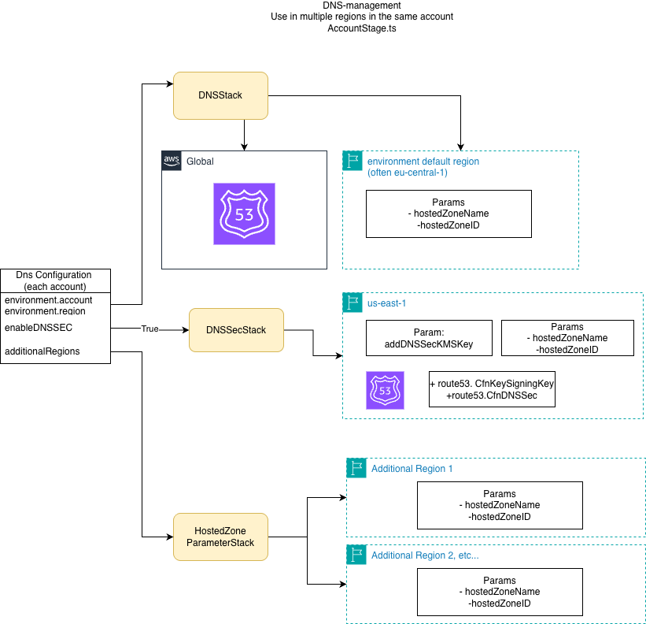

# DNS-Stack additional params

By default the AccountStage:
- Deploys the subzone HostedZone - with subdomain - in Global Route53
- Deploys hostedzoneName and hostedzoneID in configuration env region - toplevelRegion ( often eu-central-1)
- If enableDNSSEC: true deploys to us-east-1 key and adds to key to the DS Record to be signed. Also deploys hostedzoneName and hostedzoneID params to us-east-1

In case you want to use the subdomain other regions, for example Ireland us-west-1, you will only need the params hostedzoneName and hostedzoneID. 
But they have to be set.
This can be achieved with additionalRegions in the DNS Configuration properties. 

Example of account dns configuration in DNSConfiguration.ts
```
  {
    environment: Statics.gnAiAccp, // contains accountnumber and region
    name: 'ai-accp',
    enableDnsSec: true,
    additionalRegions: ['eu-west-1', 'us-east-1'],
  }
```

